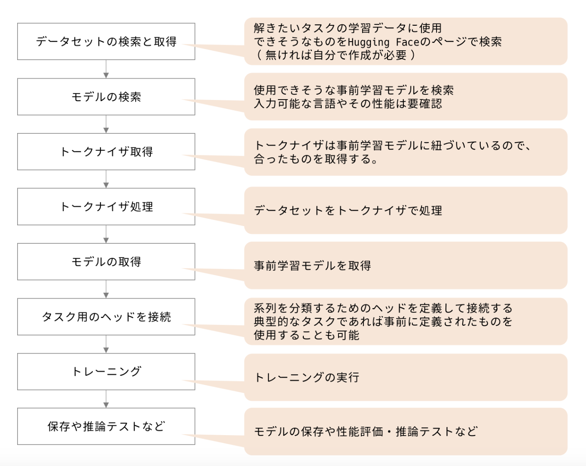

## テキスト分類
### テキスト分類の流れ

※ 画像引用元のURL：https://dev.classmethod.jp/articles/huggingface-jp-text-classification/

### 実行ファイル
- sentiment_analysis.ipynb
    - ダウンロードしたデータセットで事前学習モデルのファインチィーニングを実施。
        1. データセットのダウンロードとトークン化
        2. モデルの学習
        3. 検証データによる精度検証
        4. モデル保存

- sentiment_prediction_by_BERT_fine-tuned_model.ipynb
    - ファインチューニングモデルを用いて、感情分類を実施。
        1. ファインチューニングしたモデルの読み込み
        2. 推論対象データの読み込み・トークン化処理
        3. 推論の実行
        4. 結果の保存・可視化など

- model_evaluation.ipynb
    - ファインチューニングを行ったモデルの推論精度を混同行列にて可視化
